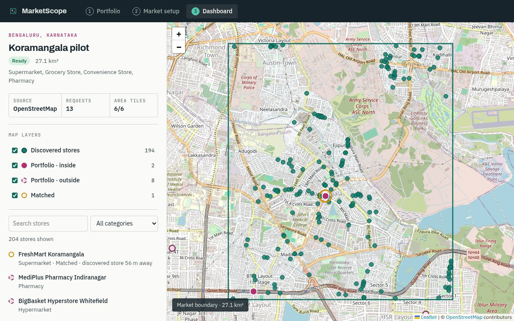
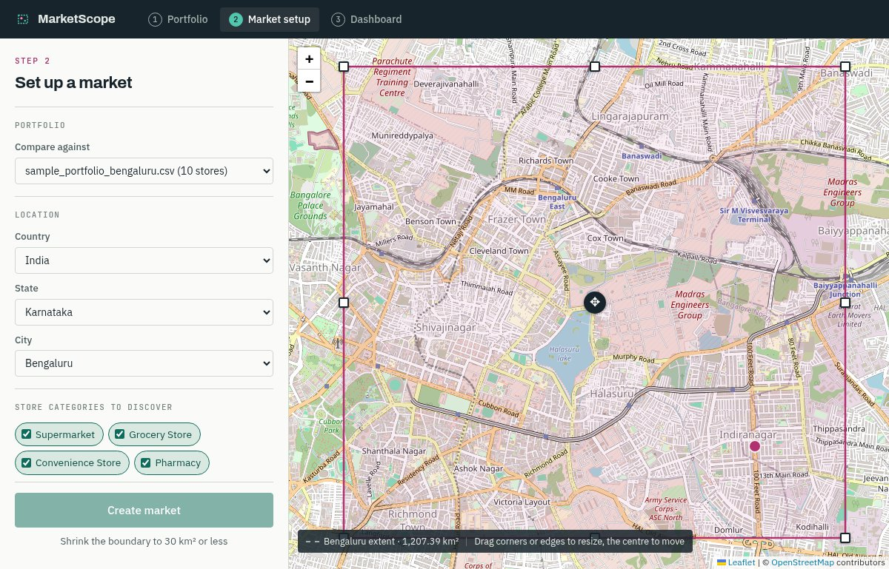
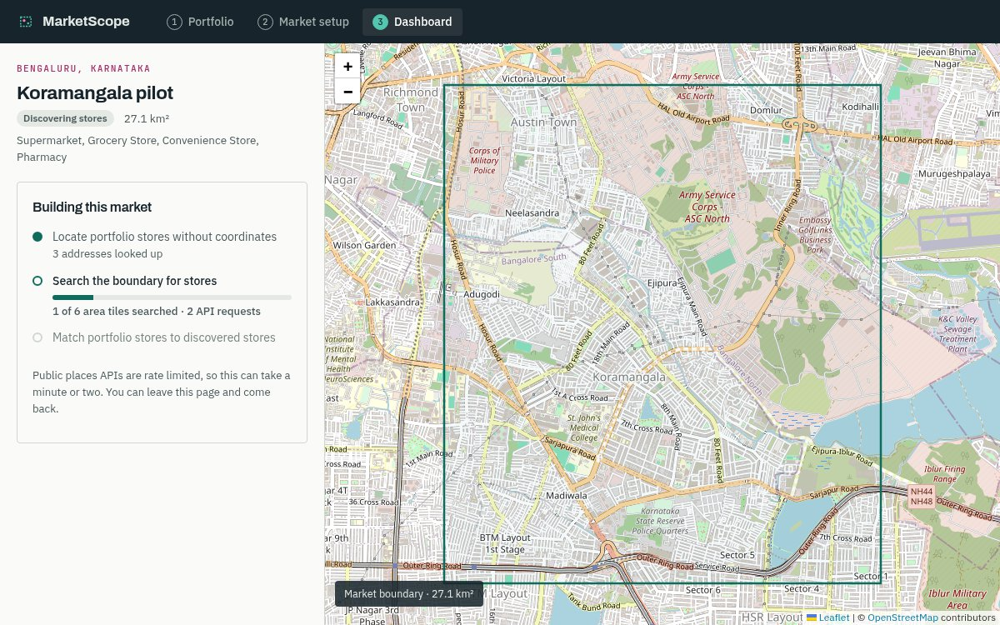
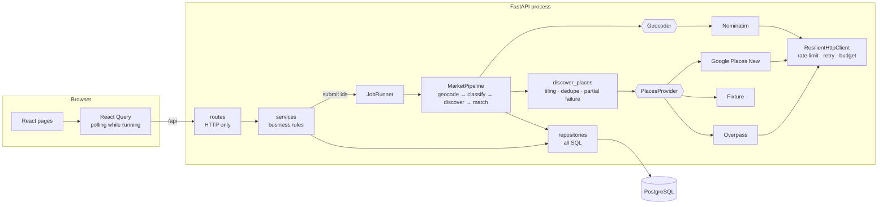
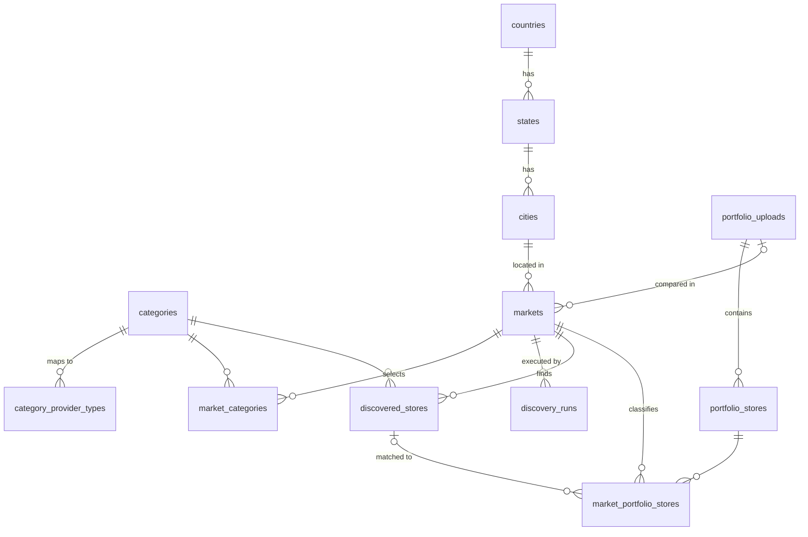

# MarketScope

The first slice of MarketScope. Upload a store portfolio, draw a market boundary over a city, discover every matching retail outlet inside it from a live places API, and compare the two on a map.



**Stack:** React 19 + TypeScript + Vite + React Query + Leaflet · Python 3.11 + FastAPI + SQLAlchemy 2 (async) + Alembic · PostgreSQL 16 · OpenStreetMap Overpass and Nominatim, with Google Places (New) behind the same interface.

---

## Contents

1. [Run it](#run-it)
2. [Walkthrough](#walkthrough)
3. [Architecture](#architecture)
4. [Decisions and trade-offs](#decisions-and-trade-offs)
5. [Data model](#data-model)
6. [API](#api)
7. [Tests](#tests)
8. [Known limitations and shortcuts](#known-limitations-and-shortcuts)
9. [What I would do next](#what-i-would-do-next)

---

## Run it

### Docker (one command)

Requires Docker with Compose v2.24 or newer.

```bash
docker compose up --build
```

Open **http://localhost:8080** and upload [`samples/sample_portfolio_bengaluru.csv`](samples/sample_portfolio_bengaluru.csv).

Migrations and seed data run automatically when the API container starts. No API keys are needed: discovery uses the public Overpass API and geocoding uses Nominatim.

To change providers or guardrails, copy `.env.example` to `.env` in the repo root before starting.

### Local development

Requires [uv](https://docs.astral.sh/uv/), Node 20+, and Docker for Postgres.

```bash
make setup      # backend and frontend dependencies
make migrate    # start Postgres in Docker, create tables, seed reference data
make api        # API on :8000 with live Overpass + Nominatim
make web        # frontend on :5173, proxies /api to :8000
```

Use `make demo` instead of `make api` for a fully offline run. It uses real OpenStreetMap data captured over central Bengaluru, so it works on a plane or when the public Overpass servers are overloaded.

### Tests

```bash
make test       # 75 backend tests + 6 frontend tests; no database or network needed
```

### Configuration

All optional. See [`.env.example`](.env.example).

| Variable | Default | Purpose |
|---|---|---|
| `PLACES_PROVIDER` | `overpass` | `overpass`, `google`, or `fixture` |
| `GOOGLE_PLACES_API_KEY` | none | Required when `PLACES_PROVIDER=google` |
| `GEOCODER` | `nominatim` | `nominatim` or `fixture` |
| `NOMINATIM_USER_AGENT` | generic | Nominatim's policy asks for contact details |
| `MAX_MARKET_AREA_SQ_KM` | `30` | Area cap, enforced in the UI and the API |
| `MAX_PROVIDER_REQUESTS_PER_MARKET` | `400` | Hard cost ceiling per market, retries included |

---

## Walkthrough

### Step 1: Portfolio upload


CSV or XLSX. Headers are normalised (`Store Name` becomes `store_name`), then validated before anything is stored:

- **Header errors.** Missing required columns and duplicate columns are listed together.
- **Row errors.** Non-numeric or out-of-range coordinates, a latitude without a longitude, and blank required fields are reported with the spreadsheet row number the user sees.
- **Policy.** An upload is all-or-nothing, and every problem is reported in one pass. See [decisions](#upload-is-all-or-nothing).

Blank latitude and longitude together is valid. Those rows are geocoded later.

### Step 2: Market setup



- **Location.** Country, State and City are dependent dropdowns fed from seeded tables.
- **Categories.** Chips for the four seeded categories. They default to the categories present in the chosen portfolio, so the first comparison is like for like.
- **Boundary.** Choosing a city fetches its bounding box from Nominatim and caches it in the database, so each city is looked up once. The city's full extent is drawn dashed. The editable rectangle can be resized from its corners and edges and moved from its centre.
- **Cost guardrail.** The area meter updates on every drag event. Above 30 km² the rectangle and meter turn magenta, the reason is stated under the button, and **Create market** is disabled. The API re-checks the cap using the identical formula.
- **Live portfolio preview.** Portfolio stores are plotted and recoloured inside or outside as the rectangle moves.

### Step 3: Market creation



`POST /api/markets` validates the request, stores the market, and returns **202** immediately. A background pipeline then runs four phases, each committing its own results:

1. **Geocode** portfolio rows without coordinates that belong to this city.
2. **Classify** every portfolio row as inside, outside or unlocated for this market.
3. **Discover** stores inside the boundary for the selected categories.
4. **Match** portfolio stores to discovered stores within 150 m. This is the bonus.

The page polls progress: phase, tiles searched, and requests spent. It is safe to leave and return.

### Step 4: Market dashboard

- **Independent layers.** Toggle discovered stores, portfolio stores inside, portfolio stores outside, and matched stores. Each shows a count.
- **List.** A searchable, category-filterable list follows the visible layers. Clicking a row flies the map to that store and opens its popup.
- **Run summary.** Shows the data source, request count, and tiles completed. If some tiles failed after retries, a warning names them instead of hiding the gap.

---

## Architecture



```
backend/app/
  api/            routes, request/response schemas, dependency wiring, one error envelope
  services/       portfolio import, locations, market creation, discovery orchestration,
                  classification and matching rules
  jobs/           in-process runner and the market pipeline
  providers/      PlacesProvider and Geocoder protocols, and their implementations,
                  plus the shared resilient HTTP client
  repositories/   SQLAlchemy queries
  domain/         BoundingBox and coordinates, portfolio file parsing, domain errors
                  (pure Python, no I/O)
  models/         ORM entities and seed data
frontend/src/
  api/            typed client and React Query hooks
  components/     map, rectangle editor, area meter, layer definitions
  pages/          one per workflow step
  lib/            geo maths mirrored from the backend, formatting
```

Routes hold no SQL and no business rules. Simple reference reads go straight to a repository, and everything else goes through a service. Services depend on provider protocols, not implementations. `providers/factory.py` is the only module that knows which API is live.

---

## Decisions and trade-offs

### A real API by default, and a swappable one

Discovery runs against **OpenStreetMap Overpass** out of the box. It is a real third-party API with real throttling, no billing setup, and no key for a reviewer to obtain. **Google Places (New)** is implemented behind the same `PlacesProvider` protocol and enabled with `PLACES_PROVIDER=google`. A **fixture** provider replays captured Overpass data for tests and offline demos.

The orchestration, persistence and UI do not know which one is running.

### Tiling, because no provider returns an arbitrary rectangle

- **Overpass** accepts a bounding box but times out on dense queries. The boundary is split into tiles of at most 2.5 km a side, and all selected categories go into one query per tile. The request count therefore scales with area, not with area × categories.
- **Google Nearby Search** restricts by circle, not rectangle, caps at 20 results, and does not paginate. Each 1 km tile is searched with its circumscribing circle. A tile that returns a full page is reported as **saturated**, and the orchestrator subdivides it into quadrants down to 150 m.

Either way, results are **filtered back to the rectangle**, because circles overhang tile corners. They are also **deduplicated on the provider's place id**, because neighbouring tiles overlap.

### Resilience: one policy, one place

`ResilientHttpClient` wraps every outbound call:

- **Rate limiting.** A shared limiter spaces requests, at 1.1 s for Nominatim to respect its policy.
- **Retries.** Timeouts, transport errors, 408, 425, 429 and 5xx responses are retried with exponential backoff and full jitter. A `Retry-After` header wins when present.
- **Overload hidden in a 200.** Overpass often answers overload with HTTP 200 and an HTML page, or JSON carrying a "runtime error" remark. Validators flag both as retryable. Each retry moves to the next Overpass mirror.
- **Request budget.** Every attempt, retries included, is counted against a per-market cap. A bug cannot burn through a free tier.

Above the HTTP layer, a tile that still fails goes to the back of the queue for **one deferred pass**, because public API overload tends to last tens of seconds. If it fails again, it is recorded and skipped. The market finishes as **"Ready with gaps"**, and the dashboard names the missed tiles. Partial data that says it is partial beats an all-or-nothing rollback.

### Market creation is a background job, with the database as the source of truth

A 30 km² market is minutes of rate-limited work in the worst case, so it cannot live inside an HTTP request. The API returns 202, and the job runs as an asyncio task.

All progress lives in the `discovery_runs` table, which the status endpoint reads. The task itself holds no state that matters. On startup, any run still marked as running is marked failed with the reason, so a crash never leaves a market stuck.

The pipeline takes plain ids, so moving it to a durable queue such as arq, Celery or SQS changes the runner, not the pipeline. See [limitations](#known-limitations-and-shortcuts).

### The area cap is enforced twice, with one formula

The frontend and backend both compute area as `R² · Δλ · (sin φ₂ − sin φ₁)`. That is exact for a latitude–longitude rectangle on a sphere, cheap, and the two implementations are tested against the same known value. The UI disables the button, and the API refuses anything over the cap anyway.

### The default boundary is not the city's extent

Nominatim's box for Bengaluru is **1,207 km²**, about forty times the cap. Showing it as the editable rectangle would open the page with a disabled button and no explanation. The API instead returns a **suggested** rectangle of 80% of the cap, centred on the city. The full extent is drawn dashed for context.

### Interpreting "geocode rows missing coordinates that fall inside the boundary"

A row's position relative to the boundary cannot be known before it has coordinates. The pipeline therefore geocodes rows without coordinates **whose city matches the market's city**, then classifies every row by its coordinates.

- **City matching.** The comparison uses seeded aliases, so "Bangalore" matches Bengaluru. The geocoding query uses the canonical names.
- **Other cities.** Rows for other cities are never sent to the geocoder. That keeps within Nominatim's no-bulk-geocoding policy, and those rows show as unlocated.
- **Fallback.** If a full address does not resolve, leading parts are dropped progressively. "80 Feet Road, Koramangala 4th Block" falls back to "Koramangala 4th Block".
- **Reuse.** Geocoded coordinates are stored on the portfolio row, so a second market does not geocode the same row again.

### Category mapping lives in the database

`category_provider_types` maps each category to one or more provider types. Four categories are seeded: Supermarket, Grocery Store, Convenience Store and Pharmacy.

- **No Hypermarket.** The brief lists Hypermarket as an example, but neither Google Places nor OpenStreetMap has a hypermarket type. The nearest stand-ins, such as wholesale, warehouse and department stores, pull in outlets that are not hypermarkets. The category is left out rather than filled with misleading results. Adding it back is a data migration that inserts the category and its provider types, with no code change.
- **Grocery Store.** It maps to `shop=grocery` and `shop=greengrocer`. In Indian OSM data, many kirana stores are tagged `shop=convenience` instead.
- **Portfolio categories are free text.** The two sample rows marked Hypermarket still upload, geocode, classify and match. They just do not pre-select a category chip.

When a place matches several selected categories, the provider's primary type decides, then category order.

### Upload is all-or-nothing

A portfolio is a snapshot of the business's estate. Silently importing 197 of 200 rows would skew every inside and outside count downstream. The whole file is rejected, but every header and row problem is reported at once, so it can be fixed in one pass. Unknown extra columns are allowed and reported as ignored.

### Plain columns, not PostGIS

A market boundary is an axis-aligned rectangle, and "inside" is four comparisons. Storing four floats keeps setup to stock Postgres, and the geo logic stays in pure Python where it is unit-tested.

The 150 m matching uses haversine over a grid index with cells slightly larger than the radius. Longitude uses one scale for the whole market, so cells keep that size in both directions. Each portfolio store checks nine cells instead of every discovered store. PostGIS would earn its place with arbitrary polygons or cross-market spatial queries.

---

## Data model



- **`cities`** caches the geocoded extent and its source. Each city also carries aliases for matching portfolio rows.
- **`portfolio_stores`** keeps the uploaded values and a geocode status: not needed, pending, succeeded or failed.
- **`market_portfolio_stores`** carries inside, outside or unlocated, plus the match. **Inside or outside is a fact about the market and store pair, not the store.** The same store can be inside one market and outside another.
- **`discovered_stores`** is unique on market, provider and provider place id. A retried tile or a re-run cannot double-insert.
- **`discovery_runs`** records tiles planned, completed and failed, provider requests, whether the budget ran out, and a capped error log. It powers the progress UI and records what each run cost.

Schema and seed data are Alembic migrations, `0001` and `0002`. The seed rows come from [`app/models/seed.py`](backend/app/models/seed.py), which the test suite also uses.

---

## API

Interactive docs are served at `http://localhost:8000/docs`. Every error uses one envelope:

```json
{ "error": { "code": "boundary_too_large", "message": "Boundary covers 41.4 km². Shrink it to 30 km² or less.", "details": { "area_sq_km": 41.4, "max_area_sq_km": 30.0 } } }
```

| Method | Path | Notes |
|---|---|---|
| `POST` | `/api/portfolio-uploads` | Multipart `file`. 201 with rows, or 422 with header and row errors |
| `GET` | `/api/portfolio-uploads` · `/{id}` | |
| `GET` | `/api/countries` · `/countries/{id}/states` · `/states/{id}/cities` | Seeded, cascading |
| `GET` | `/api/categories` | |
| `GET` | `/api/cities/{id}/boundary` | City extent, suggested rectangle, area cap |
| `POST` | `/api/markets` | 202. Starts the pipeline |
| `GET` | `/api/markets` · `/{id}` | Status and live run progress |
| `GET` | `/api/markets/{id}/stores` | All layers and counts in one payload. The client toggles layers without refetching |
| `GET` | `/api/health` | Active providers and cap |

---

## Tests

`make test` runs everything. Neither suite needs Postgres or the network.

| Area | What is covered |
|---|---|
| **Geo** | Spherical area against known values, inclusive edges, invalid boxes, tiling covers the box exactly, quadrants, circumscribed radius, suggested boundary under the cap and inside the city |
| **Header validation** | The real sample file, missing and duplicate headers, header normalisation, unknown columns, row errors with correct row numbers across blank lines, half-given coordinates, XLSX numbers and blanks, empty, corrupt and oversized files |
| **HTTP resilience** | 429 with `Retry-After`, non-retryable 4xx, HTML with a 200, validator-driven retries, mirror rotation, giving up, budget counting retries, backoff bounds |
| **Providers** | Nominatim box ordering, address fallback, Overpass query and parsing including way centres, Google circle restriction, field mask, saturation flag |
| **Discovery** | Dedupe across overlapping tiles, dropping overhang, subdividing saturated tiles, reporting saturation at minimum size, deferred retry pass, persistent failure recorded without aborting, budget exhaustion, per-tile progress, concurrency not changing results |
| **Classification** | Primary-type category resolution, dropping unselected categories, city aliases, the 150 m match boundary at 149 and 151 m, the grid index agreeing with brute force for pairs just inside the radius in any direction, nearest candidate wins |
| **End to end** | Through HTTP on SQLite with fixture providers: seeded reference data, upload success and both failure shapes, suggested boundary, cap refusal, inverted boundary, 404 envelope, and a full market run. The run asserts only selected categories, nothing outside the box, no duplicates, the expected inside and outside split for the sample, three rows geocoded, and FreshMart matched within 150 m. Also covered: rows from other cities are never geocoded |
| **Frontend** | Area parity with the backend value, normalisation of crossed handles, translation, inclusive edges |

---

## Known limitations and shortcuts

- **The job runner is in-process.** Jobs do not survive a restart. They are marked failed on the next startup rather than resumed, and they do not scale across API replicas. A production build would use a durable queue. The pipeline is already written for that move.
- **Google Places has not been exercised against the live API.** No billing account was set up for this exercise. The provider is unit-tested against mocked responses shaped after the documented Places API (New), including the request body, field mask and saturation handling.
- **OpenStreetMap coverage is uneven.** Many shops are unnamed, and they appear as "Unnamed pharmacy" and so on. Some are tagged differently from what the category mapping expects. Google's coverage of Indian retail would be denser.
- **Geocoding precision is street-level at best.** "80 Feet Road" is kilometres long, so a geocoded row can land in the wrong spot. Rows that fail to geocode are shown as unlocated, not guessed.
- **Public infrastructure is used directly.** The public Overpass, Nominatim and OSM tile servers are fine for a demo, but their usage policies do not allow production traffic. Production would use a paid provider or a self-hosted instance.
- **Out of scope per the brief.** There is no auth. The UI shows one market at a time. A boundary cannot be edited after creation. Discovery cannot be re-run from the UI, although the `discovery_runs` table and unique constraints already support it.
- **The store list is capped at 500 rows, with no marker clustering.** Canvas rendering keeps a few thousand markers smooth. Denser markets would want clustering and a virtualised list.
- **API tests run on SQLite.** They exercise the real application stack, but Postgres-specific behaviour is only covered by the Docker run. The schema avoids dialect-specific types for this reason.
- **Boundaries crossing the antimeridian are not supported**, which is irrelevant for the seeded cities.

---

## What I would do next

1. Move the pipeline to a durable queue, and add re-running discovery on an existing market, with diffing to detect openings and closures.
2. Run Google Places live, and estimate a market's request cost before creation from the tile plan, shown next to the area meter.
3. Add PostGIS once boundaries become polygons, such as a real city or ward outline, and cluster markers on the dashboard.
